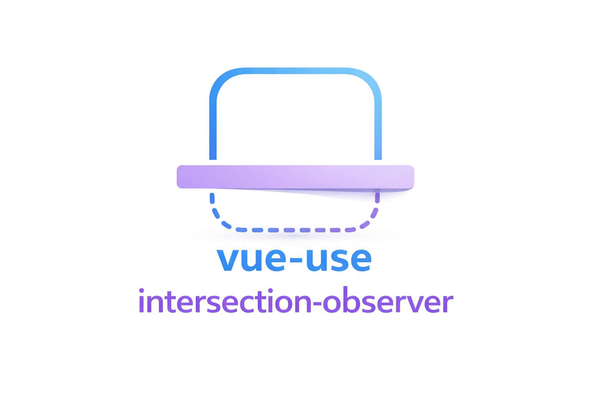

<p align="center">
  
</p>

&nbsp;

# vue-use-intersection-observer


simple and lightweight visibility observer for **vue 3**, built on top of `IntersectionObserver`.

## ✨ Features

- vue 3 plugin
- composable API
- uses native `IntersectionObserver`
- supports offsets and reactivity
- one global observer (better performance)
- fully written in typescript

## 🚀 How to use

### 📦 Installation

```bash
npm install vue-use-intersection-observer
# or
pnpm add vue-use-intersection-observer
```

### 🔌 Plugin setup

```typescript
import { createapp } from 'vue';
import app from './app.vue';
import { visibilityplugin } from 'vue-use-intersection-observer';

const app = createApp(App);
app.use(VisibilityPlugin);
app.mount('#app');
```

### 🧩 Usage (example)

```vue
<script setup lang="ts">
import { ref, onmounted } from 'vue';
import { useIntersectionObserver } from 'vue-use-intersection-observer';

const target = ref<htmlelement | null>(null);
const isvisible = ref(false);

const { observe } = useIntersectionObserver();

onmounted(() => {
  observe(target, {
    once: false,
    callback: (visible) => {
      isvisible.value = visible;
    },
  });
});
</script>

<template>
  <div
    :style="{
      position: 'fixed',
      top: '20px',
      right: '20px',
      width: '40px',
      height: '40px',
      borderradius: '50%',
      backgroundcolor: isvisible ? 'green' : 'red',
    }"
  />

  <div style="height: 150vh"></div>

  <div ref="target" style="height: 200px; background: lightgray">
    observed element
  </div>
</template>
```

### 🛠 API

#### `useIntersectionObserver()`

Composable used to observe when elements enter or leave the viewport.

```ts
const { observe, unobserve } = useIntersectionObserver();
```

&nbsp;

#### `observe()`

Start observing an element.

**Parameters:**

| Name    | Type    | Description            |
| ------- | ------- | ---------------------- |
| target  | ref     | Element ref to observe |
| options | Options | Observer configuration |

**Options:**

| Option    | Type            | Description                      | Optional | Default |
| --------- | --------------- | -------------------------------- | -------- | ------- |
| callback  | function        | Called when visibility changes   | false    | —       |
| offset    | number          | Trigger before entering viewport | true     | `0`     |
| threshold | number or array | Intersection threshold           | true     | `0`     |
| once      | boolean         | Trigger only the first time      | true     | `true`  |

&nbsp;

#### `unobserve()`

Stop observing a previously registered element.

| Name   | Type | Description                   |
| ------ | ---- | ----------------------------- |
| target | ref  | Element ref to stop observing |
